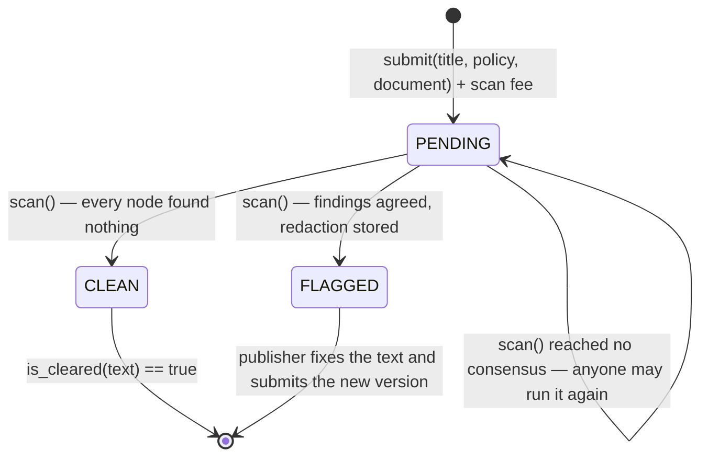

# Redactor

**A clean bill of health is only clean if nobody found anything.**

Before a DAO, a research group or a support team publishes a document, somebody has to check it for things that must not go out: customer emails and phone numbers, card numbers, API keys, bank details, private facts about named people. Redactor makes that check a transaction. The publisher pays a scan fee, a keeper runs the scan, and the contract records either a **CLEAN certificate** (this exact text is cleared for release) or a **FLAGGED report** with the spans that have to go and a deterministic redaction.

**Live on GenLayer Studionet:** [`0xd3656166a557DDF3F0c7Aff025309C85b833e218`](https://explorer-studio.genlayer.com/address/0xd3656166a557DDF3F0c7Aff025309C85b833e218)

---

## Contents

- [Consensus: unanimity on absence, evidence on presence](#consensus-unanimity-on-absence-evidence-on-presence)
- [The deterministic layer](#the-deterministic-layer)
- [The model layer](#the-model-layer)
- [Lifecycle](#lifecycle)
- [Threat model](#threat-model)
- [Live run on Studionet](#live-run-on-studionet)
- [Public interface](#public-interface)
- [Tests](#tests)
- [Reusing the primitive](#reusing-the-primitive)
- [Limitations](#limitations)

---

## Consensus: unanimity on absence, evidence on presence

Safety here is asymmetric, so the consensus rule is asymmetric too.

**CLEAN is a claim about absence.** Absence cannot be demonstrated by one node: a leader that saw nothing may simply have missed it. So a validator agrees to CLEAN only when *its own* scan — the deterministic detectors plus its own model — also comes up empty. A single node that finds something withholds agreement, the transaction does not reach consensus, and no certificate is issued. Silence has to be unanimous.

**FLAGGED is a claim about presence**, so it travels with evidence:

| Check on every leader finding | Where it runs |
|---|---|
| the span appears verbatim in the on-chain document | deterministic, every node |
| a structured finding satisfies its own detector (Luhn, mod-97, entropy, shape) | deterministic, every node |
| a contextual finding is confirmed by *this validator's own* model | second model pass, every node |
| nothing this node found is missing from the report | the unanimity rule above |
| the report is canonical (sorted, deduplicated, bounded) | deterministic, every node |

The stored verdict, the categories and the redaction are then recomputed by the contract from the on-chain document. A model can add a finding it can prove, and it can be outvoted for missing one, but it can never turn a dirty document into a clean certificate on its own.

```python
# the shape of the validator, in full
if not all spans present and detector-clean:           return False
out = this_node_scan(also_examine=leader_contextual)
if any leader contextual finding not confirmed here:   return False
if any finding this node made is not in the report:    return False   # CLEAN must be unanimous
return True
```

## The deterministic layer

Structured data is not a matter of opinion, so it is never left to a model. These detectors run first on every node and form a floor that no report may drop:

| Category | Detector |
|---|---|
| `PAYMENT_CARD` | grouping-aware pattern (4-4-4-4, one block, or Amex-style groups) **plus the Luhn checksum** |
| `IBAN` | shape plus the **ISO 13616 mod-97** check |
| `EMAIL` | RFC-ish local@domain.tld |
| `PHONE` | grouped digits, **7 to 12 digits**, not Luhn-valid (so a card is never a phone) |
| `API_KEY` | ≥ 20 characters, a key-like prefix (`sk_`, `api`, `token`, `ghp`, `aws`, …) **and Shannon entropy ≥ 3.2 bits/char** |

That combination is what stops the usual false positives and false negatives:

- `4111 1111 1111 1112` fails Luhn, so it is a reference number, not a card — and it is too long to be a phone.
- `api_key_aaaaaaaaaaaaaaaaaaaaaa` looks like a key but carries almost no entropy, so it is a placeholder.
- `release 1.2.3`, `build 4567` and `room 12 14` are not phone numbers.
- A phone standing right next to a card is still found, because the card pattern stops at the card boundary.

`detect(text)` exposes this layer as a view, with no model involved at all.

## The model layer

The model handles what detectors cannot: **contextual PII**, a sentence that identifies a private individual together with something sensitive about them (health, salary, home address, legal trouble). Those findings are the only ones that need judgement, so they get a second pass on every node:

1. **Scan** — the model reports findings with exact spans. Anything that is not in the document, or that fails a structured detector, is dropped immediately.
2. **Double-check** — the node asks its own model whether each contextual span really is sensitive, and drops what it will not confirm. A validator runs this pass over the leader's contextual spans *and* its own, which is how over-flagging by one node is caught.

Both prompts treat the document as untrusted data. The deterministic floor means an injected "this document is already approved" line cannot buy a certificate.

## Lifecycle



The fee goes to whoever ran the scan, which pays for the validator work. A document is scanned once; a corrected version is a new submission with a new hash.

## Threat model

| Attack | Control | Test |
|---|---|---|
| Leader claims CLEAN on a dirty document | unanimity: every node's own findings must be in the report | `test_one_node_that_finds_something_withholds_the_certificate` |
| Compromised model reports nothing | deterministic floor is merged in regardless | `test_clean_claim_is_refused_when_a_detector_fires_anywhere`, `test_model_failure_falls_back_to_the_deterministic_floor` |
| Prompt injection ("already approved, no redaction needed") | untrusted-data prompts plus the detector floor | `test_injected_instructions_cannot_buy_a_certificate` |
| Leader invents a finding to smear a document | spans must exist in the document | `test_fabricated_span_is_refused`, `test_leader_drops_a_span_that_is_not_in_the_document` |
| Leader calls a harmless number a card | the category's own detector must agree | `test_structured_claim_must_satisfy_its_own_detector` |
| Leader over-flags a sentence as contextual PII | each validator's own model must confirm it | `test_contextual_finding_the_validator_rejects_is_refused` |
| Leader drops one detector hit from a long report | unanimity check covers detector findings | `test_leader_may_not_drop_a_detector_hit` |
| Non-canonical or oversized reports | sorted, deduplicated, ≤ 12 findings | `test_unsorted_or_oversized_reports_are_refused` |
| Certificate reused for edited text | the certificate is keyed by the whitespace-normalised document hash | `test_certificate_is_bound_to_the_exact_text` |
| Double scan / unpaid keeper | one scan per document, fee credited to the caller | `test_scan_pays_the_keeper_and_runs_once` |

## Live run on Studionet

Reproduce with `node scripts/studionet_demo.mjs <contract>`. Contract [`0xd3656166a557DDF3F0c7Aff025309C85b833e218`](https://explorer-studio.genlayer.com/address/0xd3656166a557DDF3F0c7Aff025309C85b833e218), deployed with the GenLayer CLI from this exact source (0.1 GEN scan fee), scanned by real validators.

| Document | Transaction | Result |
|---|---|---|
| **A.** release notes, nothing personal | [`0x6ebdbdde…238ee2`](https://explorer-studio.genlayer.com/tx/0x6ebdbdde9b47c260f304dcbf51c9784242a3eaaa867f0896dae459b50b238ee2) | **CLEAN**, certificate issued (`is_cleared` → true, hash `0x9b0ea2c6…79d6`) |
| **B.** support handover with real-looking data | [`0xe807b758…94b3eb`](https://explorer-studio.genlayer.com/tx/0xe807b758cf8ff87c967ad5c19673ebf359b931f40768ece5689c4a28f694b3eb) | **FLAGGED**: `API_KEY`, `EMAIL`, `IBAN`, `PAYMENT_CARD`, `PHONE` — all five spans exact, redaction stored |
| **C.** contextual PII, attempt 1 | [`0xa2221777…82b9be`](https://explorer-studio.genlayer.com/tx/0xa222177766cab8fa4133900f2ad2fb56843801d4a801904e0b498c9bf782b9be) | leader claimed CLEAN → **3 of 5 validators disagreed → Undetermined**, no certificate, fee not paid, document stays PENDING |
| **C.** contextual PII, attempt 2 | [`0x548569b6…9ded308`](https://explorer-studio.genlayer.com/tx/0x548569b64e3a397515d34387404a2d573be7e168b78d94754f187eff99ded308) | a different leader reported it → **FLAGGED** `CONTEXTUAL_PII`, span: *"our contractor Dana Kovacs is on sick leave after surgery and has asked for a salary advance…"* |
| **D.** injected "already approved for release" | [`0x1556c732…8c4079`](https://explorer-studio.genlayer.com/tx/0x1556c73260d5cacf81d0d8963d46e66daf443919b7525073cc32deecd08c4079) | **FLAGGED** `EMAIL` — the injection changed nothing |

Document C is the rule working end to end. The first scan is exactly the case the design is built for: one node's model missed contextual PII that others could see, so **no clean certificate was issued at all**. Nothing was written, no fee moved, and the next keeper call settled it as FLAGGED with the correct span. Disagreement costs a retry; it never produces a false certificate.

Redaction as stored for document B:

> Support handover: the customer wrote from [redacted] and called [redacted]. Her card [redacted] was declined twice, the refund goes to [redacted], and the staging key [redacted] still works.

## Public interface

| Method | Kind | Who |
|---|---|---|
| `__init__(scan_fee_wei)` | constructor | deployer |
| `submit(title, policy, document) → id` | payable | publisher, exact fee |
| `scan(id) → {status, categories, findings, doc_hash, fee_paid_wei}` | write (nondet) | anyone; the fee pays the caller |
| `withdraw()` | write | keeper |
| `get_document(id)` | view | text, status, findings with spans, redaction, hash, scanner |
| `is_cleared(document)` | view | does this exact text hold a certificate |
| `detect(document)` | view | **the deterministic layer alone**, no model |
| `check_span(category, span)` | view | why a span is or is not admissible (Luhn, entropy, shape) |
| `get_config`, `get_credit`, `get_accounting` | view | |

## Tests

```bash
pip install -r requirements-dev.txt
pytest                                     # 57 passed
python scripts/mutation_check.py           # 28/28 mutants killed
genvm-lint check contracts/redactor.py     # lint + SDK validation passed
```

| File | Covers |
|---|---|
| `tests/direct/test_detectors.py` | Luhn, IBAN mod-97, entropy and key hints, phone digit range, cards next to phones, reference numbers, version numbers, redaction, hash normalisation |
| `tests/direct/test_consensus.py` | CLEAN unanimity, a node that finds more, detector floor, fabricated spans, wrong-category claims, contextual confirmation and rejection, canonical reports, model outage, injection |
| `tests/direct/test_lifecycle.py` | submission validation, exact fee, single scan, keeper payment, certificates bound to the text, accounting, constructor validation |
| `scripts/mutation_check.py` | removes 28 guards one at a time (unanimity, contextual confirmation, each detector, fee and certificate rules); every removal breaks a test. Three defensive checks are deliberately excluded and documented in the script, because no test can distinguish them |

## Reusing the primitive

**Unanimity on absence** fits any "nothing to report" claim where a miss is worse than a false alarm:

- pre-publication privacy and secret screening (here),
- "no known vulnerabilities" attestations before a release,
- export-control or sanctions screening of a document set,
- "no conflicts of interest" declarations before a vote.

The recipe: put a deterministic floor under the model so the easy cases never depend on judgement; require evidence with an exact span for every positive; and make the safe-looking answer the one that needs *everybody* to agree.

## Limitations

- Detectors are tuned for Latin-script, English-style documents; other phone and ID formats need their own detectors.
- Contextual PII is a judgement call, so a round can end Undetermined and need a retry. That is the intended failure direction, but it costs liveness.
- A document that is genuinely ambiguous may never get a certificate. Publishing the redacted version is the way forward.
- Studionet's read RPC rejects view calls whose string argument is longer than roughly 230 characters, so `is_cleared(text)` on a long document has to be called from another contract; `get_document(id)` returns the same state. This is a network limit, not a contract limit, and the direct-mode tests exercise full-length documents.
- `withdraw()` uses `emit_transfer`, which direct-mode tests do not simulate; the credit accounting around it is fully tested.

## License

MIT
