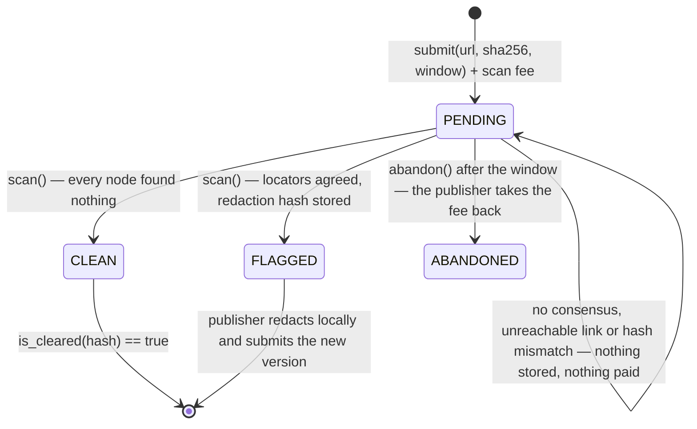

# Redactor

**A clean bill of health is only clean if nobody found anything.**

Before a DAO, a research group or a support team publishes a document, somebody has to check it for things that must not go out: customer emails and phone numbers, card numbers, API keys, bank details, private facts about named people. Redactor makes that check a transaction.

The document itself never touches the chain. The publisher commits a **URL and a SHA-256**; validators fetch the text themselves, refuse to scan anything that does not hash to the commitment, and record either a **CLEAN certificate** for that exact hash or a **FLAGGED report** of **locators** — category, start offset, length — plus the hash of the redacted copy. No document text, no sensitive span and no redacted copy is ever written to storage.

**Live on GenLayer Studionet:** [`0x0b715Fa8cE9E85573499Be4380111B5430ed1f23`](https://explorer-studio.genlayer.com/address/0x0b715Fa8cE9E85573499Be4380111B5430ed1f23)

---

## Contents

- [What changed after review](#what-changed-after-review)
- [Nothing sensitive reaches the chain](#nothing-sensitive-reaches-the-chain)
- [Consensus: unanimity on absence, evidence on presence](#consensus-unanimity-on-absence-evidence-on-presence)
- [The deterministic layer](#the-deterministic-layer)
- [The model layer](#the-model-layer)
- [Lifecycle and the recovery path](#lifecycle-and-the-recovery-path)
- [Threat model](#threat-model)
- [Live run on Studionet](#live-run-on-studionet)
- [Public interface](#public-interface)
- [Tests](#tests)
- [Reusing the primitive](#reusing-the-primitive)
- [Limitations](#limitations)

---

## What changed after review

Review raised two mandatory issues against the first version, and both are fixed here.

> *"Do not put the unredacted document or exact sensitive spans into publicly readable contract state (the current submit/get_document flow exposes the material before redaction)."*

The first version took the document as an argument to `submit()` and stored it, then stored the findings as quoted spans and the redacted text. On a public chain that republished exactly what the gate exists to protect. The data model is now commit-and-fetch:

| | v1 | v2 |
|---|---|---|
| What `submit()` takes | the full document text | a **URL and a SHA-256 commitment** |
| What storage holds | document, spans, redacted text | url, hash, **locators (category, start, length)**, redaction **hash** |
| How a node reads the text | from storage | fetches it inside the nondeterministic block, and refuses to scan unless it hashes to the commitment |
| How the publisher checks the result | read it back from the chain | `verify_locally(id, text)` in a view, or recompute off-chain from the locators |
| Certificate lookup | `is_cleared(text)` — sent the document to a node | `is_cleared(hash)` |

`test_privacy.py` asserts the property directly: after submitting and scanning a document full of test data, no email, card number, IBAN, key, phone number, sentence, or even the string `[redacted]` appears anywhere in `get_document()`.

> *"Add a defined timeout or cancellation path that lets the publisher recover the scan fee when repeated validator disagreement leaves a document PENDING."*

Contextual PII is a judgement call, so rounds really do fail to settle — the v1 live run showed exactly that, with three of five validators refusing a CLEAN claim. v2 makes that recoverable:

- `submit()` takes a `scan_window_seconds` (10 minutes to 30 days) and stores a deadline,
- `scan()` reverts once the window closes, so there is no race with the exit,
- `abandon()` lets the **publisher** reclaim the full scan fee afterwards and marks the document `ABANDONED`,
- an unreachable link or a hash mismatch settles nothing and pays nobody, so those rounds also end at the same exit.

## Nothing sensitive reaches the chain

```
publisher                     chain                         validators
   | host the document          |                               |
   | submit(url, sha256, fee) ->|  url + hash + fee             |
   |                            |------------- scan() --------->| fetch url
   |                            |                               | sha256 must equal the commitment
   |                            |<-- verdict + locators + ------| detectors + model
   |                            |    redaction hash             |
   | verify_locally(text) ----->|  rebuild the redaction        |
```

What a reader of the chain learns about a flagged document: that it has, say, an `EMAIL` at offset 42 of length 20. Not the address. The redaction hash lets the publisher prove their redacted copy is the agreed one without publishing either copy.

This is as private as a public network allows, and the README is explicit about the remaining exposure: validators must be able to read the document while they scan it, so the link is public for that window. A publisher should host it somewhere unguessable or access-limited and take it down afterwards; the commitment keeps the certificate meaningful once the link is gone.


## Consensus: unanimity on absence, evidence on presence

Safety here is asymmetric, so the consensus rule is asymmetric too.

**CLEAN is a claim about absence.** Absence cannot be demonstrated by one node: a leader that saw nothing may simply have missed it. So a validator agrees to CLEAN only when *its own* scan — the deterministic detectors plus its own model — also comes up empty. A single node that finds something withholds agreement, the transaction does not reach consensus, and no certificate is issued. Silence has to be unanimous.

**FLAGGED is a claim about presence**, so it travels with evidence:

| Check on every leader finding | Where it runs |
|---|---|
| the locator points inside the document **this node fetched** | deterministic, every node |
| a structured finding satisfies its own detector (Luhn, mod-97, entropy, shape) | deterministic, every node |
| a contextual finding is confirmed by *this validator's own* model | second model pass, every node |
| nothing this node found is missing from the report | the unanimity rule above |
| the report is canonical (sorted, deduplicated, ≤ 12 findings) | deterministic, every node |
| the redaction hash equals the hash of this node's own redaction | deterministic, every node |
| the verdict follows the findings, and a mismatch or an unreachable link settles nothing | deterministic, every node |

Because the chain holds no text, the agreement itself is the verification: every node checks the leader's locators against the bytes it fetched, and the bytes are pinned by the commitment. A model can add a finding it can prove, and it can be outvoted for missing one, but it can never turn a dirty document into a clean certificate on its own.

```python
# the shape of the validator, in full
out = this_node_scan(also_judge=leader_contextual_locators)   # fetch, hash check, detect, ask
if out.verdict is MISMATCH or UNREACHABLE or so is theirs:
    return verdicts match and nothing was claimed
for locator in claimed:                                        # evidence, at this node's bytes
    if not admissible(out.text, locator, out.confirmed): return False
for locator in out.mine:                                       # CLEAN must be unanimous
    if locator not in claimed: return False
return verdict follows findings and redaction hash == hash(redact(out.text, claimed))
```

## The deterministic layer

Structured data is not a matter of opinion, so it is never left to a model. These detectors run first on every node and form a floor that no report may drop:

| Category | Detector |
|---|---|
| `PAYMENT_CARD` | grouping-aware pattern (4-4-4-4, one block, or Amex-style groups) **plus the Luhn checksum** |
| `IBAN` | shape plus the **ISO 13616 mod-97** check |
| `EMAIL` | RFC-ish local@domain.tld |
| `PHONE` | grouped digits, **7 to 12 digits**, not Luhn-valid (so a card is never a phone) |
| `API_KEY` | ≥ 20 characters, a key-like prefix (`sk_`, `api`, `token`, `ghp`, `aws`, …) **and Shannon entropy ≥ 3.2 bits/char** |

That combination is what stops the usual false positives and false negatives:

- `4111 1111 1111 1112` fails Luhn, so it is a reference number, not a card — and it is too long to be a phone.
- `api_key_aaaaaaaaaaaaaaaaaaaaaa` looks like a key but carries almost no entropy, so it is a placeholder.
- `release 1.2.3`, `build 4567` and `room 12 14` are not phone numbers.
- A phone standing right next to a card is still found, because the card pattern stops at the card boundary.

`detect(text)` exposes this layer as a view, with no model involved at all.

## The model layer

The model handles what detectors cannot: **contextual PII**, a sentence that identifies a private individual together with something sensitive about them (health, salary, home address, legal trouble). Those findings are the only ones that need judgement, so they get a second pass on every node:

1. **Scan** — the model reports findings with exact spans. Anything that is not in the document, or that fails a structured detector, is dropped immediately.
2. **Double-check** — the node asks its own model whether each contextual span really is sensitive, and drops what it will not confirm. A validator runs this pass over the leader's contextual spans *and* its own, which is how over-flagging by one node is caught.

Both prompts treat the document as untrusted data. The deterministic floor means an injected "this document is already approved" line cannot buy a certificate.

## Lifecycle and the recovery path



The fee goes to whoever ran the scan that settled the document, which pays for the validator work. Three things leave a document PENDING and pay nobody: validators that cannot agree, a link that cannot be fetched, and bytes that do not match the commitment. All three end at the same exit — anyone may `scan()` again until the deadline, and after it the publisher calls `abandon()` and is refunded in full.

## Threat model

| Attack | Control | Test |
|---|---|---|
| Leader claims CLEAN on a dirty document | unanimity: every node's own findings must be in the report | `test_one_node_that_finds_something_withholds_the_certificate` |
| Compromised model reports nothing | deterministic floor is merged in regardless | `test_clean_claim_is_refused_when_a_detector_fires_anywhere`, `test_model_failure_falls_back_to_the_deterministic_floor` |
| Prompt injection ("already approved, no redaction needed") | untrusted-data prompts plus the detector floor | `test_injected_instructions_cannot_buy_a_certificate` |
| Leader invents a finding to smear a document | the locator must point at text that satisfies its category here | `test_a_locator_pointing_at_innocent_text_is_refused`, `test_locators_outside_the_document_are_refused` |
| Leader calls a harmless number a card | the category's own detector must agree at that offset | `test_a_locator_pointing_at_innocent_text_is_refused` |
| Leader over-flags a sentence as contextual PII | each validator's own model must confirm it | `test_contextual_finding_the_validator_rejects_is_refused` |
| Leader drops one detector hit from a long report | unanimity check covers detector findings | `test_a_dropped_finding_is_refused` |
| Non-canonical or oversized reports | sorted, deduplicated, ≤ 12 findings | `test_non_canonical_and_malformed_reports_are_refused` |
| Certificate reused for edited text | certificates are keyed by the committed hash | `test_certificates_are_looked_up_by_hash_not_by_text` |
| **The chain republishing what it screens** | no method takes the text; storage holds a url, a hash and offsets | `test_submission_never_carries_the_document`, `test_a_flagged_report_stores_locations_not_text` |
| **Document swapped after submission** | every node refuses to scan unless the fetched bytes hash to the commitment | `test_the_scan_refuses_a_document_that_does_not_match_its_commitment` |
| **Leader faking a mismatch to stall** | the other nodes fetched it fine, so the verdict is refused | `test_a_claimed_mismatch_must_be_seen_by_this_node_too` |
| **Fee stuck behind endless disagreement** | scan window plus `abandon()` refund | `test_a_document_that_never_settles_can_be_abandoned_for_a_refund` |
| Refund taken twice, or after a scan settled | `abandon()` only while PENDING, only after the deadline | `test_abandon_cannot_take_the_fee_twice_or_after_a_scan` |
| Double scan / unpaid keeper | one scan per document, fee credited to the caller | `test_scan_pays_the_keeper_and_runs_once` |

## Live run on Studionet

Reproduce with `node scripts/studionet_demo.mjs <contract> [--with-abandon]`. Contract
[`0x0b715Fa8cE9E85573499Be4380111B5430ed1f23`](https://explorer-studio.genlayer.com/address/0x0b715Fa8cE9E85573499Be4380111B5430ed1f23), deployed with the GenLayer CLI from
this exact source, 0.1 GEN scan fee, scanned by real validators. The three demo documents are
synthetic fixtures in `demo/`, served over https so validators can fetch them; every value in
them is fake (`4111 1111 1111 1111` is the standard test card, `GB82WEST12345698765432` the
ISO 13616 example IBAN).

| Document | Transaction | Result |
|---|---|---|
| **A.** release notes, nothing personal | [`0x103defe5…e543f1`](https://explorer-studio.genlayer.com/tx/0x103defe56b8d3f2da993028baeec5b76f72e209ca67f5ede1a77bc8c60e543f1) | **CLEAN**, certificate issued for hash `0x9b0ea2c6…79d6` |
| **B.** support handover with five kinds of personal data | [`0xc164656b…d10a72`](https://explorer-studio.genlayer.com/tx/0xc164656b64fa4446ef9a6d7911a4355f64f357877759ecf68765cc3790d10a72) | **FLAGGED**: `API_KEY`, `EMAIL`, `IBAN`, `PAYMENT_CARD`, `PHONE` as five locators, redaction hash `0x41b11bd9…1a40d` |
| **C.** contractor on sick leave asking for a salary advance | [`0xeddc42c7…411713`](https://explorer-studio.genlayer.com/tx/0xeddc42c7c0c7643da97144f52142d9c5de26fef1dac612b5cc2c5508ac411713) | **FLAGGED** `CONTEXTUAL_PII` at offset 16, length 129 (3 validators agreed, 2 disagreed) |

What the chain stores for document B — the entire record, verbatim:

```json
{"category": "EMAIL",        "start": 42,  "length": 20}
{"category": "PHONE",        "start": 74,  "length": 16}
{"category": "PAYMENT_CARD", "start": 101, "length": 19}
{"category": "IBAN",         "start": 160, "length": 22}
{"category": "API_KEY",      "start": 204, "length": 28}
```

No address, no number, no key, no sentence. Rebuilding the redaction from those five locators
and the publisher's own copy gives

> Support handover: the customer wrote from [redacted] and called [redacted]. Her card
> [redacted] was declined twice, the refund goes to [redacted], and the staging key
> [redacted] still works.

whose hash equals the `redacted_hash` the validators agreed on — the demo prints
`matches stored hash: true` for both flagged documents.

### The recovery path, on chain

Reproduce with `--with-abandon`. Document D is submitted with the minimum 10 minute window and
deliberately never scanned, which is the same end state as a document validators keep failing
to agree on.

| Step | Transaction | Result |
|---|---|---|
| **Submit D** with a 600 second window, 0.1 GEN fee | [`0x3bd5bc44...709961`](https://explorer-studio.genlayer.com/tx/0x3bd5bc445953ff397d5f17dc78d98dfa5c7ca4ec816f9de8d388a6764e709961) | `SUCCESS`, `PENDING`, deadline stored |
| **Scan D after the deadline** | [`0x37146fb8...ec07ed`](https://explorer-studio.genlayer.com/tx/0x37146fb817ad1b6b788fa5673b078b8feb521ca60c418039e30ba20001ec07ed) | `ERROR` — the window is closed, so there is no race with the exit |
| **Abandon D** (publisher) | [`0x98826404...3f3da8`](https://explorer-studio.genlayer.com/tx/0x98826404d384157ac634ac439b2e6e9feebd0dbcc63e34e07831241a8a3f3da8) | `SUCCESS`, status `ABANDONED`, reason `abandoned_after_deadline` |

The publisher's withdrawable credit before and after, read straight from the contract:

```
publisher_credit_before: 0
publisher_credit_after:  100000000000000000   # the whole 0.1 GEN scan fee, back
```

`get_accounting()` then reports `total_fees_held_wei: 0` — nothing of document D's fee stayed
in the contract. A publisher whose document never settles waits out the window they chose and
is made whole; nobody is paid for a scan that produced no verdict.

> The rejected first version is still on chain at
> [`0xd3656166a557DDF3F0c7Aff025309C85b833e218`](https://explorer-studio.genlayer.com/address/0xd3656166a557DDF3F0c7Aff025309C85b833e218) for comparison. Its `get_document`
> returns the full text and the quoted spans, which is exactly what this version removes.

## Public interface

| Method | Kind | Who |
|---|---|---|
| `__init__(scan_fee_wei)` | constructor | deployer |
| `submit(title, policy, url, document_hash, scan_window_seconds) → id` | payable | publisher, exact fee |
| `scan(id) → {status, reason, findings, categories, redacted_hash, fee_paid_wei}` | write (nondet) | anyone, before the deadline; the fee pays the caller |
| `abandon(id) → refund` | write | **publisher, after the deadline** |
| `withdraw()` | write | keeper or publisher |
| `get_document(id)` | view | url, hash, status, **locators only**, redaction hash, deadline |
| `is_cleared(document_hash)` | view | does this hash hold a certificate |
| `verify_locally(id, document)` | view | **for whoever has the text**: rebuilds the redaction from the stored locators and checks both hashes |
| `detect(document)` | view | the deterministic layer alone, no model, nothing stored |
| `check_span(category, span)` | view | why a span is or is not admissible (Luhn, entropy, shape) |
| `get_config`, `get_credit`, `get_accounting` | view | |

## Tests

```bash
pip install -r requirements-dev.txt
pytest                                     # 75 passed
python scripts/mutation_check.py           # 34/34 mutants killed
genvm-lint check contracts/redactor.py     # lint + SDK validation passed
```

| File | Covers |
|---|---|
| `tests/direct/test_privacy.py` (8) | nothing sensitive in stored state after submit or after a flagged scan, locators that rebuild the redaction locally, certificates by hash, commitment mismatch, unreachable document |
| `tests/direct/test_detectors.py` (28) | Luhn, IBAN mod-97, entropy and key hints, phone digit range, cards next to phones, reference numbers, version numbers, redaction, hash normalisation |
| `tests/direct/test_consensus.py` (18) | CLEAN unanimity, dropped findings, locators pointing at innocent or out-of-range text, wrong redaction hash, non-canonical reports, faked and real mismatches, contextual confirmation and rejection, model outage, injection |
| `tests/direct/test_lifecycle.py` (21) | submission and URL validation, scan window, keeper payment, **the abandon refund path**, double-refund protection, rescan after a round that settled nothing, accounting |
| `scripts/mutation_check.py` | removes 34 guards one at a time (commitment check, unanimity, locator admissibility, redaction hash, each detector, scan window, abandon rules); every removal breaks a test. A few structural properties and indistinguishable defensive checks are excluded and documented in the script |

## Reusing the primitive

**Unanimity on absence** fits any "nothing to report" claim where a miss is worse than a false alarm:

- pre-publication privacy and secret screening (here),
- "no known vulnerabilities" attestations before a release,
- export-control or sanctions screening of a document set,
- "no conflicts of interest" declarations before a vote.

The recipe: put a deterministic floor under the model so the easy cases never depend on judgement; require evidence with an exact span for every positive; and make the safe-looking answer the one that needs *everybody* to agree.

## Limitations

- Validators must be able to read the document while they scan it, so the link is public for that window. Host it somewhere unguessable or access-limited, and take it down afterwards: the commitment keeps the certificate meaningful once the link is gone. A public blockchain cannot screen a document nobody is allowed to read.
- A document that changes between submission and scan simply never settles, by design. The publisher resubmits with the new hash.
- Detectors are tuned for Latin-script, English-style documents; other phone and ID formats need their own detectors.
- Contextual PII is a judgement call, so rounds can fail to settle. That is the intended failure direction, and `abandon()` bounds the cost to one scan fee of waiting.
- Studionet's read RPC rejects view calls whose string argument is longer than roughly 230 characters, so `verify_locally()` on a long document has to be called from another contract or recomputed off-chain. The redaction is a pure function of the text and the stored locators, so the demo script rebuilds it locally when the RPC refuses the call.
- `withdraw()` uses `emit_transfer`, which direct-mode tests do not simulate; the credit accounting around it is fully tested.

## License

MIT
